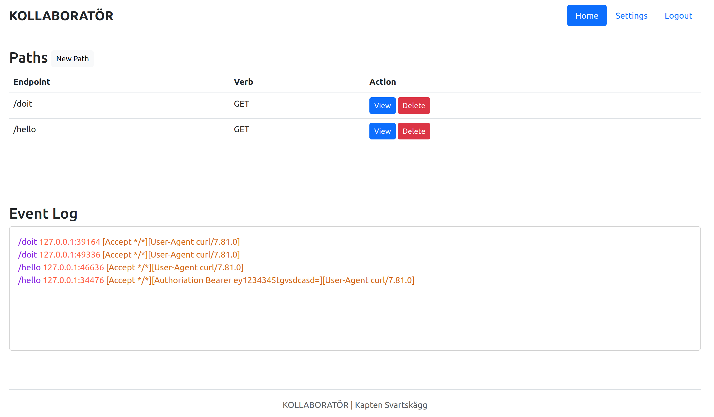
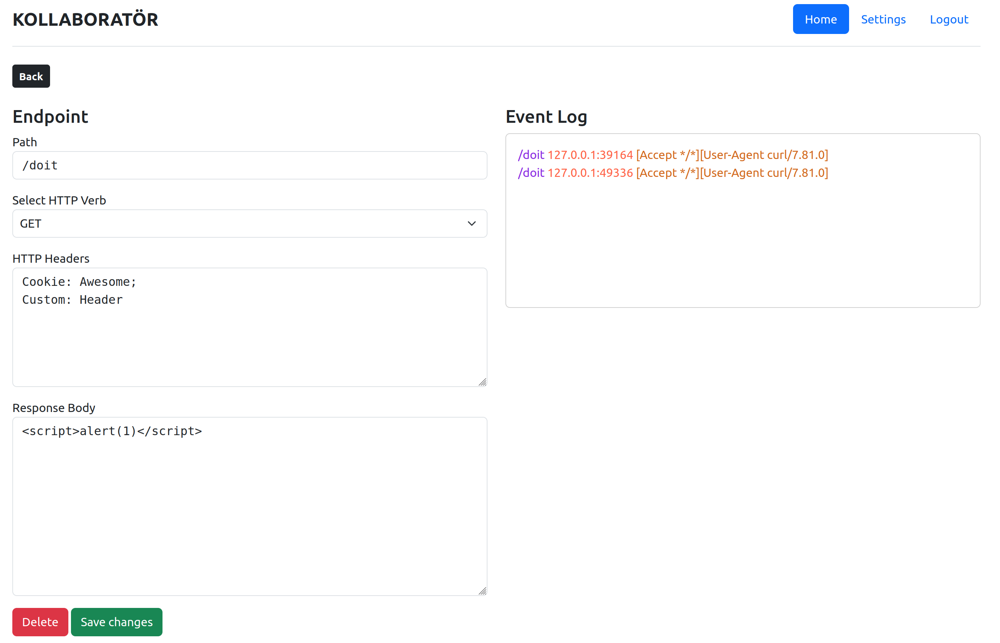

# KOLLABORATÖR

Hey there, picture this: you want to have some XSS, DTD files, or random data on your server, and a target machine will grab it through JavaScript or XXE vulnerabilities, for instance. To get this done, you just pop into your server using SSH and set up nginx to serve files from a certain directory. Next up, create the files you'd like to serve. This tool makes it all a breeze, taking care of everything with a user-friendly graphical interface. Easy peasy!

## Screenshots



## Develop
Go project:
```
$ go build .
$ ./kollab
```

Frontend project:
```
$ cd frontend
$ npm install
$ npm run dev -- --open
```

To generate static files: `npm run build`

## Docker
Download the appropriate image from https://github.com/dubs3c/kollab/pkgs/container/kollab.

Create a new container based on the image.
```
sudo docker run -d -p 127.0.0.1:80:80 d7086d146964
```

Visit http://127.0.0.1/mgmt, login with `kollab:thekollab`.

## TODO
- [ ] When you delete a path, delete corresponding logs
- [ ] Randomize basic auth password on every startup, print new password in console for user
- [ ] DNS pingback functionality
- [ ] Improve frontend - store a subset of event logs in the browser 

## Contributing
Any feedback or ideas are welcome! Want to improve something? Create a pull request!

1. Fork it!
2. Create your feature branch: `git checkout -b my-new-feature`
3. Commit your changes: `git commit -am 'Add some feature'`
4. Push to the branch: `git push origin my-new-feature`
5. Submit a pull request :D
